# RickAndMorty-GraphQL

This project was built with Android Studio Dolphin, with clean architecture in a multi-modules structure. The core module is the center and other modules branch off from it. The data module wraps remote, hubSrc, and local modules. Each module has its own interface and hubSrc module implements these interfaces. There's also a common and a domain module inside the core. The features module outside of the core uses the domain module and its usecases.

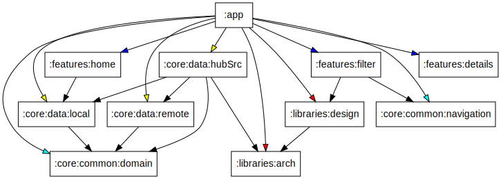
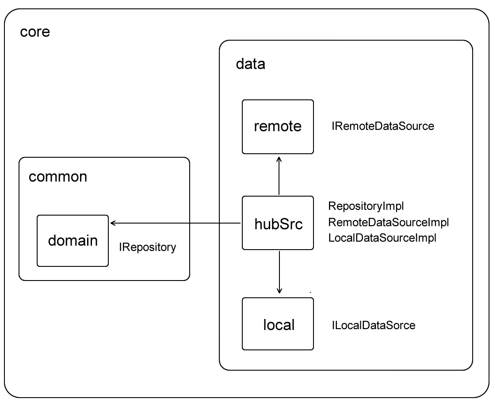

## Screens
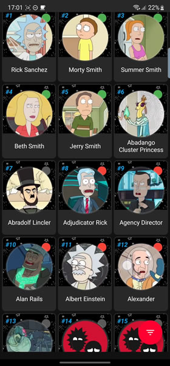 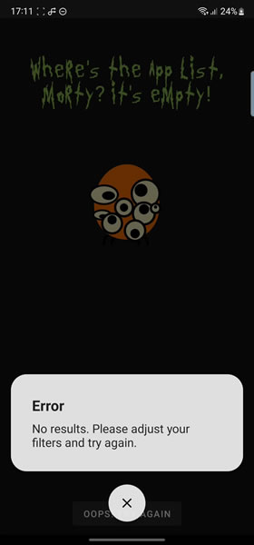 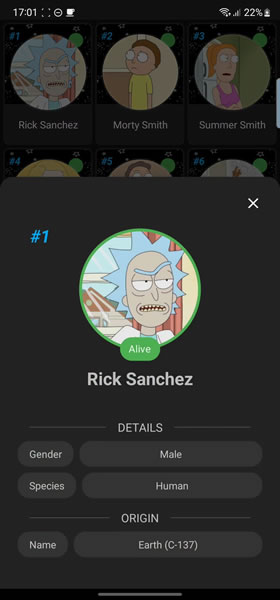
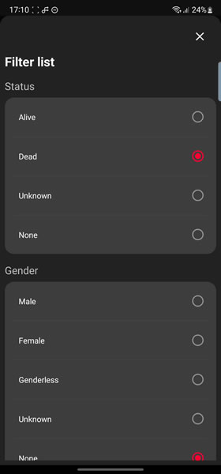 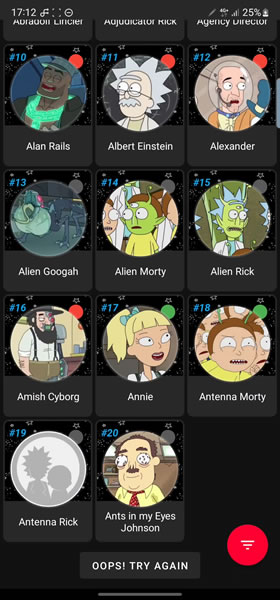 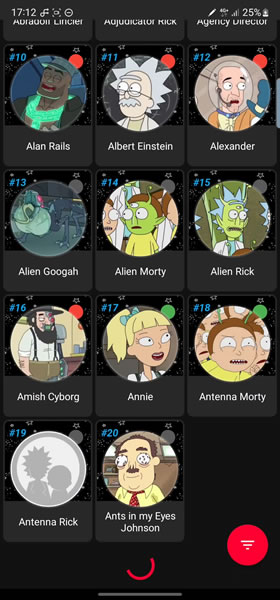

## GIFS
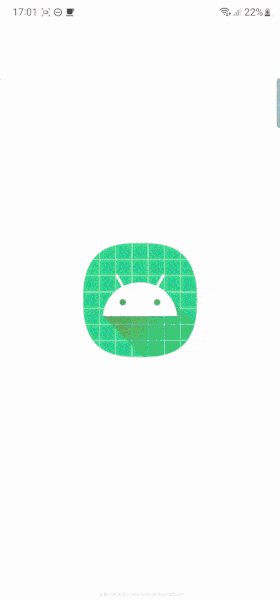 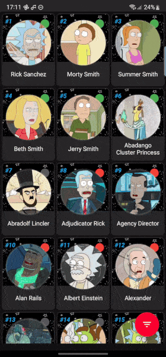 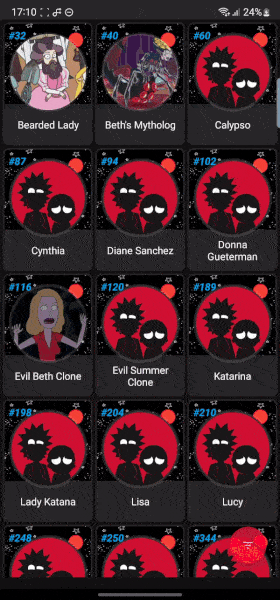
